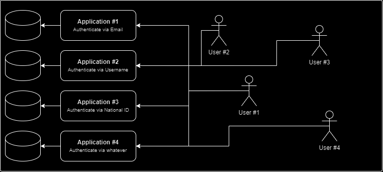

# keycloak-boring-dilemma

Dilemma: How can we implement Single Sign-On (SSO) in the most efficient way and enable lazy developer mode, considering the scenario where four applications coexist in the same environment and users employ various identifiers to log in to these applications?

<h1 align="center">
   
  
   
</h1>

Goal: Implement Single Sing-On (SSO) with least amout of work possible.
